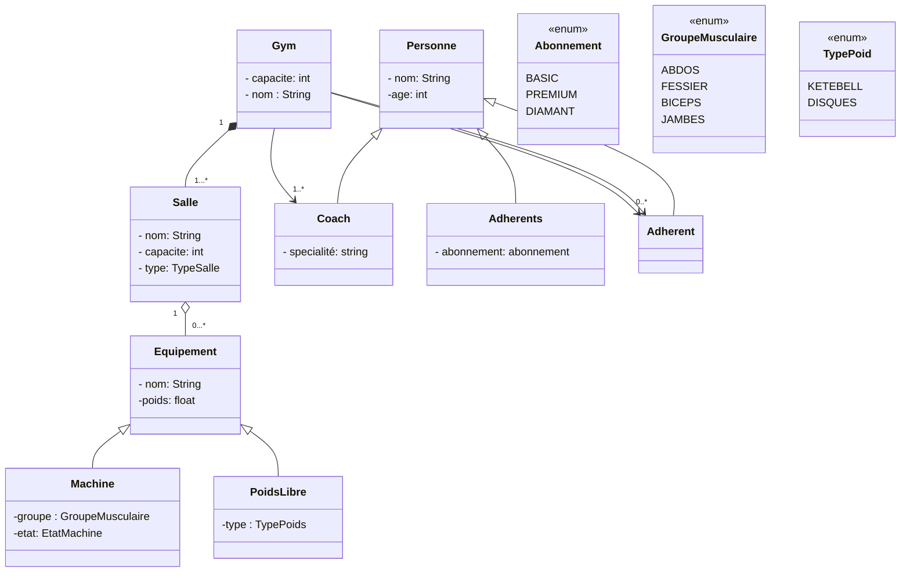

```mermaid
classDiagram
class Gym {
- capacite: int
- nom : String 
}
class Equipement {
- nom: String
-poids: float
}

class Salle {
- nom: String
- capacite: int
- type: TypeSalle
}
class Personne{
- nom: String
-age: int}
class Coach{
- specialité: string}
class Adherents{
- abonnement: abonnement
}
class PoidsLibre{ 
    -type : TypePoids
    }
    class Abonnement{
<<enum>>
BASIC
PREMIUM
DIAMANT   }
class Machine{
        -groupe : GroupeMusculaire
        -etat: EtatMachine
    }
    class GroupeMusculaire{
<<enum>>
ABDOS
FESSIER
BICEPS
JAMBES}
class TypePoid{
        <<enum>>
        KETEBELL
        DISQUES }
        
        Personne <|-- Coach
    Personne <|-- Adherents
    Personne <|-- Adherent
    Gym "1"*--"1...*" Salle
    Salle "1"o--"0...*" Equipement
    Gym --> Adherent
    Gym --> "0..*" Adherent
    Gym --> "1..*" Coach
    Equipement <|-- Machine
    Equipement <|-- PoidsLibre


```